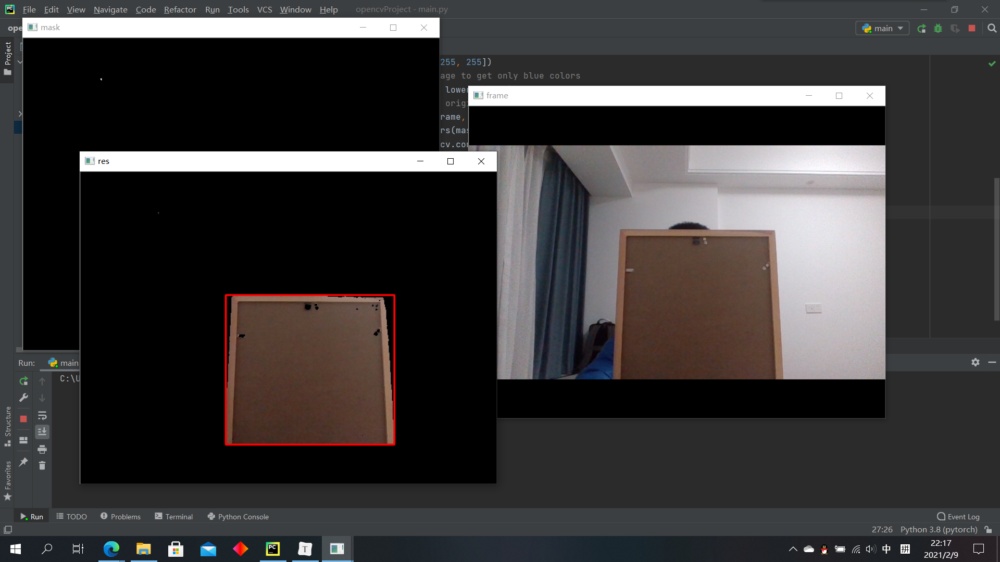

# Task02：图像储存、色彩空间、图像的算术运算

## 思考题

#### 1. HSV和BGR三原色在图片信息存储的差别在哪？

在RGB颜色空间中，任意色光F都可以用R、G、B三色不同分量的相加混合而成：F=r[R]+r[G]+r[B]。RGB色彩空间还可以用一个三维的立方体来描述。当三基色分量都为0(最弱)时混合为黑色光；当三基色都为k(最大，值由存储空间决定)时混合为白色光。


HSV是一种将RGB色彩空间中的点在倒圆锥体中的表示方法。HSV即色相(Hue)、饱和度(Saturation)、明度(Value)，又称HSB(B即Brightness)。色相是色彩的基本属性，就是平常说的颜色的名称，如红色、黄色等。饱和度（S）是指色彩的纯度，越高色彩越纯，低则逐渐变灰，取0-100%的数值。明度（V），取0-max(计算机中HSV取值范围和存储的长度有关)。HSV颜色空间可以用一个圆锥空间模型来描述。圆锥的顶点处，V=0，H和S无定义，代表黑色。圆锥的顶面中心处V=max，S=0，H无定义，代表白色。


## 练习题

#### 1. 编写一段程序实现以下功能:

代码调用电脑摄像头，寻找视野中任意颜色（自定）并具有一定大小的物体，并用矩形框处，最后显示在图像上

```python
import cv2 as cv
import numpy as np

cap = cv.VideoCapture(0)
if not cap.isOpened():
    print("Cannot open camera")
    exit()
while True:
    ret, frame = cap.read()
    if not ret:
        print("Can't receive frame (stream end?). Exiting ...")
        break
    hsv = cv.cvtColor(frame, cv.COLOR_BGR2HSV)
    # define range of blue color in HSV
    lower = np.array([0, 60, 50])
    upper = np.array([20, 255, 255])
    # Threshold the HSV image to get only blue colors
    mask = cv.inRange(hsv, lower, upper)
    # Bitwise-AND mask and original image
    res = cv.bitwise_and(frame, frame, mask=mask)
    cnt, _ = cv.findContours(mask.copy(), cv.RETR_EXTERNAL, cv.CHAIN_APPROX_SIMPLE)
    cnt = sorted(cnt, key=cv.contourArea, reverse=True)
    rect = cv.boundingRect(cnt[0])
    cv.rectangle(res, rect, [0, 0, 255], 2, cv.LINE_8)
    cv.imshow('frame', frame)
    cv.imshow('mask', mask)
    cv.imshow('res', res)
    if cv.waitKey(1) == ord('q'):
        break
cap.release()
cv.destroyAllWindows()
```



#### 2. 创建一个视频用来演示一幅图如何平滑的转换成另一幅图（使用函数[cv.addWeighted](https://docs.opencv.org/4.1.0/d2/de8/group__core__array.html#gafafb2513349db3bcff51f54ee5592a19)）

```python
import cv2 as cv

img1 = cv.imread('awesomeface.png')
img2 = cv.imread('container.jpg')
img2 = cv.resize(img2, img1.shape[:2])
video = cv.VideoWriter('result.mp4', cv.VideoWriter_fourcc(*'MP4V'), 30, img1.shape[:2])
for i in range(0, 101):
    y = i / 100
    x = 1 - y
    frame = cv.addWeighted(img1, x, img2, y, 0)
    video.write(frame)
    cv.imshow('frame', frame)
    cv.waitKey(1)

cv.waitKey(0)
video.release()
cv.destroyAllWindows()
```

<video id="video" controls="" preload="none">
    <source id="mp4" src="Task02：图像储存、色彩空间、图像的算术运算.assets/result.mp4" type="video/mp4">
</video>

