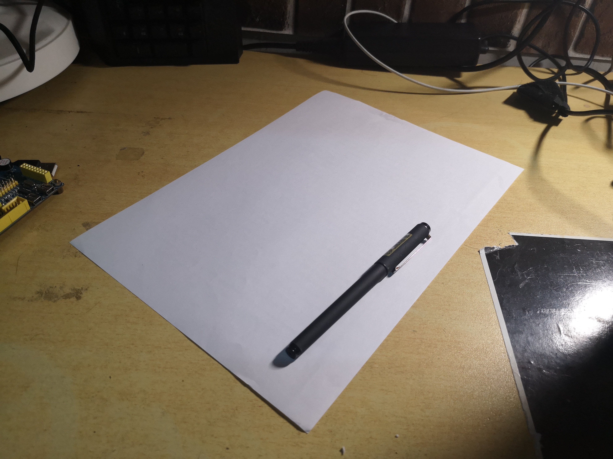
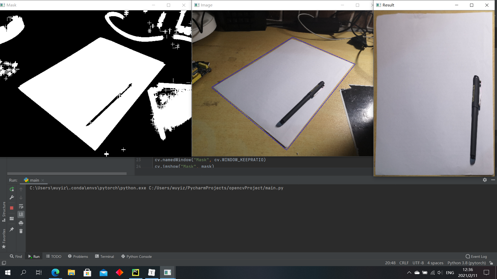
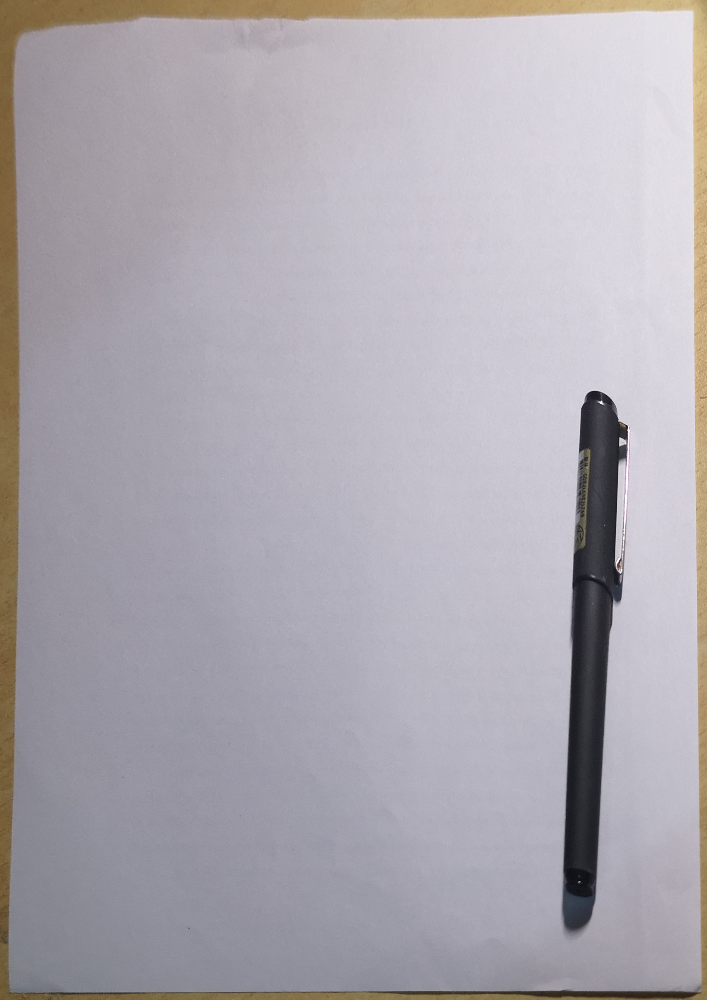

# Task03：几何变换

## 练习题

#### 1. 将下面纸张通过变换调节至正中央水平竖直放置，最终呈现的图片效果上要保留白纸外的区域：



```python
import cv2 as cv
import numpy as np

src = cv.imread("task3_1.jpg")
hsv = cv.cvtColor(src, cv.COLOR_BGR2HSV)
lower = np.array([0, 0, 100])
upper = np.array([255, 50, 255])
mask = cv.inRange(hsv, lower, upper)
kernel = cv.getStructuringElement(cv.MORPH_CROSS, (80, 80))
mask = cv.dilate(mask, kernel)
cnt, _ = cv.findContours(mask.copy(), cv.RETR_EXTERNAL, cv.CHAIN_APPROX_SIMPLE)
cnt = sorted(cnt, key=cv.contourArea, reverse=True)
poly = cv.approxPolyDP(cnt[0], 500, True)
width = 2100
height = 2970
pts = np.float32([poly[0][0], poly[1][0], poly[2][0], poly[3][0]])
screen = np.float32([[0, 0], [0, height], [width, height], [width, 0]])
perspective = cv.getPerspectiveTransform(pts, screen)
res = cv.warpPerspective(src, perspective, (width, height), cv.INTER_LINEAR)
cv.drawContours(src, [poly], 0, (255, 0, 0), 5)
cv.namedWindow("Image", cv.WINDOW_KEEPRATIO)
cv.imshow("Image", src)
cv.namedWindow("Mask", cv.WINDOW_KEEPRATIO)
cv.imshow("Mask", mask)
cv.namedWindow("Result", cv.WINDOW_KEEPRATIO)
cv.imshow("Result", res)
cv.imwrite("result.jpg", res)
cv.waitKey(0)
```



